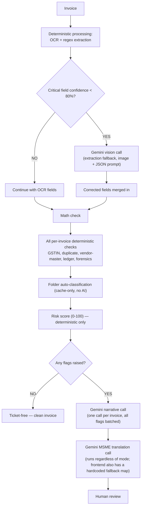

# AI Architecture

## Why AI is used
Two narrow jobs, both chosen because they're things an LLM is genuinely good
at and rules are not: (1) reading a messy/low-confidence invoice image when
regex-on-OCR-text comes up empty or unsure, and (2) turning a terse rule
output (`"check": "duplicate_invoice", "reason": "Exact duplicate of invoice
at index 3..."`) into a sentence a non-technical reader can act on.

## Why AI is NOT used for every invoice
Cost and reliability. `gemini_fallback.py` only fires when a *critical*
field (invoice number, vendor name, total amount) scores below an 80%
confidence threshold — most clean OCR extractions never touch it.
`narrative_generator.py` only fires when there's at least one flag to
explain — a clean invoice produces zero AI calls beyond the (conditional)
extraction fallback. This is the literal "rule → cache → AI" principle from
the project plan, and it is genuinely implemented this way in the code, not
just described that way.

**Caching, now real**: `classification/vendor_cache.py` backs the folder
auto-classification step (`folder_sorter.py`, wired into `orchestrator.py`)
— a vendor's category is looked up from a persisted CSV cache, never
re-derived with AI, and it's genuinely on the live per-invoice path today.
What's still *not* wired is the AI half that would populate new categories
for unseen vendors (`classification/vendor_classifier.py`) — an unrecognized
vendor is currently filed under `extra` rather than auto-classified by AI.
So today it's accurately "rule → cache" for classification, and separately
"rule → AI" for extraction fallback and narratives — say both pieces
precisely rather than compressing them into one slogan.

## What information is sent to AI
- **Extraction fallback**: the raw image bytes of the invoice page + a list
  of which fields are missing/low-confidence. No other invoices, no database
  contents, no vendor history are sent.
- **Narrative generation**: only the `check` name and rule-generated `reason`
  string for each flag on *this* invoice — e.g. `{"check": "invalid_gstin",
  "reason": "GSTIN '24ABC...' fails checksum validation..."}`. No raw invoice
  image, no other invoices' data.
- **MSME translation**: the narrative text already generated in the previous
  step, asking for a simpler rewrite.

## What AI returns
A JSON array of strings (one per input item) for narrative/translation
calls, or a JSON object of field values for the extraction fallback. All
three functions strip markdown code fences before parsing and validate with
`json.loads` inside a `try/except`.

## How hallucinations are controlled
- The AI is never asked to invent a risk score, a check name, or a
  duplicate/mismatch/vendor-match/ledger-match determination — those are
  100% pre-computed by deterministic code before any AI call happens.
- Prompts explicitly request "ONLY a JSON array/object, no markdown, no
  explanation" to minimize free-form drift.
- Every AI call site is wrapped in `try/except Exception`, and on any
  parsing failure the code falls back to the original rule-generated string
  rather than showing a broken or hallucinated sentence. `msme_translator.py`
  failures are additionally caught one level up in `orchestrator.py`, and
  `routes_frontend_adapter.py` keeps its own hardcoded per-check MSME
  fallback sentence map as a second safety net for the invoice detail view.

## How deterministic checks remain authoritative
`risk_scorer.py` never imports or calls anything from `ai_layer/`. The
AI functions all take an *already-computed* scoring/ticket dict as their
input and only add narrative text fields (`narrative`, `msme_narrative`,
`summary`) — they cannot change `risk_score` or `risk_level`, and there's no
code path where they're given the opportunity to. Folder assignment
(`folder_sorter.py`) is likewise pure cache/rule lookup with no AI call in
its path.

## What happens if the AI API is unavailable
- **Extraction fallback failure**: `gemini_fallback.fix_fields()` retries 2
  times with exponential backoff (also applied on a 30-second per-attempt
  timeout, via a thread pool), then returns `{field: None}` for whatever
  couldn't be recovered. The invoice is still processed; those fields end up
  in `needs_review` for human attention.
- **Narrative/translation failure**: caught and replaced with the raw rule
  `reason` string (narrative) or the prior narrative (MSME translation) — the
  ticket is created regardless, just with less polished wording.
- In no case does an AI API outage block an upload, crash the pipeline, or
  change the risk score.

## Token/cost optimization — implemented
1. Extraction fallback only triggers on low-confidence *critical* fields, not
   every field on every invoice.
2. Narrative generation batches every flag on one invoice into a single
   Gemini call, rather than one call per flag.
3. Clean invoices (no flags at all) never call the narrative or MSME
   translation functions.
4. Folder classification never calls AI at all today — it's a pure cache
   lookup, the cheapest possible outcome of the "rule → cache → AI" ladder.

**Not yet implemented**: cross-invoice narrative batching ("5 invoices
tripping the same rule from the same vendor share one explanation," as
described in the project plan) — today each invoice's narrative call is
independent, even if the invoice next to it in the same batch shares the
identical flag; and the AI vendor classifier (`vendor_classifier.py`) that
would let the cache learn new vendor categories automatically instead of
filing everything unrecognized under `extra`.
