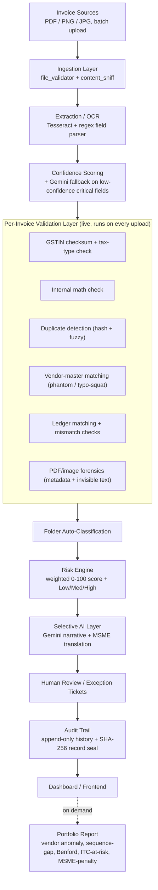
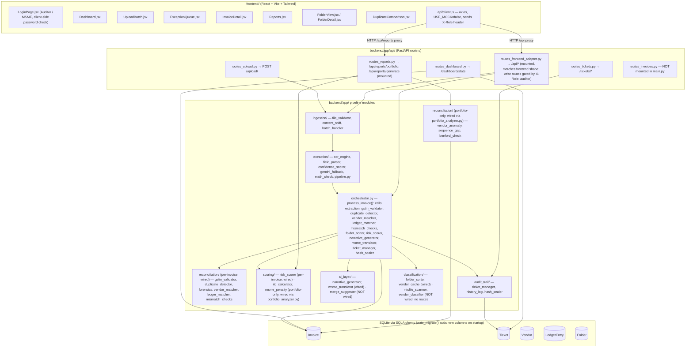

# Architecture

Two views: what a judge should see (high-level), and what's actually true in
the code (detailed, with wired vs. not-wired called out explicitly).

## 1. High-level architecture

**Not pictured because not wired today**: ticket-merge suggestion
(`merge_suggester.py`), misfiled-invoice scanning (`misfile_scanner.py`), and
standalone AI vendor classification (`vendor_classifier.py`) all exist as
real modules under `backend/app/ai_layer/` and `backend/app/classification/`,
but nothing in the app calls them yet. See `FACT_SHEET.md` for the complete
wired/unwired table.

## 2. Detailed technical architecture

### Why this shape
- **Ingestion before extraction**: rejects bad files (wrong type, empty,
  oversized, no extractable text) before spending any OCR or AI budget on
  them — cheapest checks run first.
- **Extraction before validation**: nothing can be checked for GSTIN
  correctness or duplication until fields exist.
- **Deterministic checks before AI**: GSTIN checksum, math, duplicate
  detection, vendor-master matching, ledger matching, and forensics are pure
  computation — free, instant, and authoritative. The risk score is built
  entirely from their output.
- **Classification alongside validation**: `folder_sorter.py` runs in the
  same per-invoice pass, using a cached vendor→category map
  (`vendor_cache.py`) so it never has to call an AI model to file a known
  vendor's invoice.
- **AI only after scoring**: Gemini is called to *narrate* an
  already-computed risk result, not to decide the score itself. If Gemini
  fails, `narrative_generator.py` catches the exception and falls back to
  the raw rule reason string, and `routes_frontend_adapter.py` has its own
  hardcoded MSME-fallback map per check type — the ticket still gets
  created and displayed either way.
- **Audit trail last**: every invoice gets a SHA-256 seal over its final
  field values, and every ticket action goes through `history_log.py`,
  which appends rather than overwrites.
- **Portfolio checks are separate from the per-invoice path on purpose**:
  vendor anomaly (z-score), sequence-gap, and Benford's Law only make
  statistical sense across a *set* of invoices for the same vendor, so they
  run in `portfolio_analyzer.py` on demand from the Reports page rather than
  once per upload.

### Honest gaps in this diagram
- `routes_frontend_adapter.py` effectively duplicates some of what
  `routes_upload.py` and `routes_tickets.py` do, but reshapes the JSON to
  match what the frontend's `client.js` expects. This means there are two
  working upload endpoints (`/upload/` and `/api/invoices/upload`) with
  slightly different response shapes — worth consolidating post-hackathon,
  and worth knowing so you don't call the wrong one live.
- `client.js` calls `POST /api/vendors/correct` and `POST /api/tickets/merge`,
  neither of which exists in `routes_frontend_adapter.py` — these UI actions
  will fail against the real backend.
- The `X-Role: auditor` gate on write routes is read from a request header
  the frontend sets after a client-side password check; it is not
  cryptographic authentication (see `SECURITY.md`).
