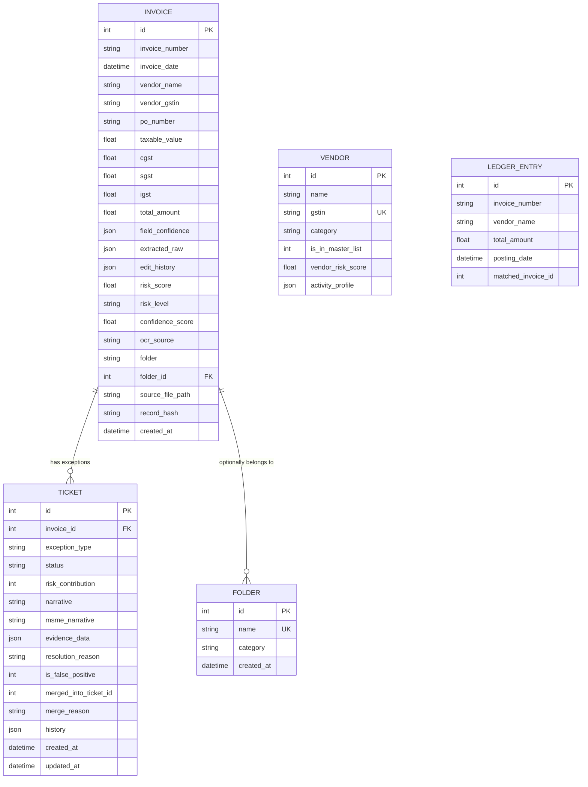

# Database / ER Diagram

SQLite by default (`DATABASE_URL` env var swaps the connection string;
Postgres is untested in this repo). `db/database.py`'s `auto_migrate()` runs
on every startup and adds any column a model gained since the last run,
without dropping data. Five SQLAlchemy models exist; all five are now
populated by the running code (via `db/seed.py`, or directly for `Invoice`/
`Ticket` on every upload).

## In plain terms
- **Invoice** is the central record: one row per uploaded document, holding
  both the raw extracted fields (`extracted_raw`, `field_confidence` as JSON
  blobs) and the computed outcome (`risk_score`, `risk_level`,
  `confidence_score`, `folder`). `record_hash` is the SHA-256 seal computed
  once the row is finalized. `edit_history` is new — it's an append-only
  JSON log of manual field corrections made via `PATCH /api/invoices/{id}`.
- **Ticket** is one row per *contributing check* on an invoice — if an
  invoice trips both the duplicate check and the GSTIN check, it gets two
  tickets, each independently reviewable/resolvable. `invoice_id` is a
  foreign key back to `Invoice`. `history` is an append-only JSON list built
  by `history_log.py` — no row in it is ever deleted or edited, only added.
  `evidence_data` is new — it stores structured pointers (e.g.
  `duplicate_invoice_id`) that the frontend uses to link a duplicate ticket
  to the invoice it duplicates.
- **Vendor** and **LedgerEntry** now have a real path into the database:
  `db/seed.py` loads the generated `vendor_master.csv`/`ledger.csv` into
  these tables as part of seeding the demo dataset. At request time,
  `orchestrator.py`'s `_get_vendor_master_df()` / `_get_ledger_df()` helpers
  try the DB tables first and fall back to reading the CSVs directly via
  `pandas` only if the tables are empty — so both paths work, but a freshly
  seeded system runs entirely off the DB tables.
- **Folder** is new — it backs the folder CRUD endpoints
  (`GET/POST /api/folders`) so a folder can exist (and be shown in the UI)
  even before any invoice has been filed into it. `Invoice.folder` (a plain
  string) remains the field actually used for filtering/grouping invoices;
  `Invoice.folder_id` is set when a matching `Folder` row exists, but
  nothing currently requires one to.

## Why this design
- JSON columns (`field_confidence`, `extracted_raw`, `edit_history`,
  `evidence_data`, `history`) keep the schema stable while the shape of
  extracted fields or audit events evolves — a reasonable hackathon
  trade-off; a production version would likely normalize `history` into its
  own table for queryability.
- Splitting `Ticket` from `Invoice` (rather than one flags-array column on
  `Invoice`) means each exception has its own lifecycle (open → resolved),
  which is what the resolution/merge/false-positive endpoints operate on.
- `auto_migrate()` exists so that adding a column to a model (like
  `edit_history` or `evidence_data` were) doesn't require a manual migration
  script or a dropped/recreated dev database — it inspects the live schema
  and adds only what's missing, skipping unsafe additions (e.g. a `NOT NULL`
  column with no default on a non-empty table) with a logged warning instead
  of crashing.
