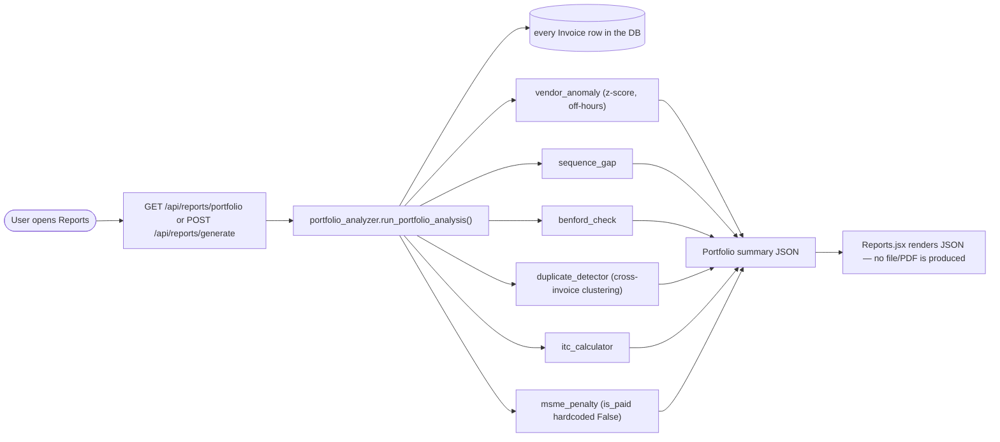

# Data Flow Diagram

Shows the actual objects that move through the system for one invoice, on
the live wired path (upload → `/api/invoices/upload` or `/upload/`), plus
the separate on-demand portfolio flow.

```mermaid
flowchart LR
    U([User]) -->|drags PDF/PNG/JPG| FE[Frontend: UploadBatch.jsx]
    FE -->|multipart POST| API["API: routes_upload.py / routes_frontend_adapter.py"]
    API --> ING["Ingestion: file_validator + content_sniff"]
    ING -->|"raw bytes, filename"| OCR["Extraction: ocr_engine (Tesseract)"]
    OCR -->|"raw OCR text + avg_conf"| PARSE["field_parser (regex)"]
    PARSE -->|"extracted fields dict"| CONF["confidence_scorer"]
    CONF -->|"per-field confidence"| FALLBACK{"critical field<br/>confidence < 80%?"}
    FALLBACK -->|yes| GEMINI["gemini_fallback.py<br/>Gemini vision call"]
    FALLBACK -->|no| MATH["math_check.py"]
    GEMINI -->|"corrected fields"| MATH
    MATH -->|"math_ok, fields"| ORCH["orchestrator.process_invoice()"]
    ORCH --> GSTIN["gstin_validator"]
    ORCH --> DUP["duplicate_detector<br/>(against all prior DB rows)"]
    ORCH --> VMATCH["vendor_matcher<br/>(reads Vendor table or vendor_master.csv)"]
    ORCH --> LMATCH["ledger_matcher + mismatch_checks<br/>(reads LedgerEntry table or ledger.csv)"]
    ORCH --> FORENSIC["forensics<br/>(metadata + invisible text)"]
    ORCH --> SORT["folder_sorter + vendor_cache<br/>(assigns folder, no AI)"]
    GSTIN -->|"flags"| SCORE["risk_scorer<br/>0-100 + level"]
    DUP -->|"flags"| SCORE
    VMATCH -->|"flags"| SCORE
    LMATCH -->|"flags"| SCORE
    FORENSIC -->|"flags"| SCORE
    MATH -->|"flags"| SCORE
    SCORE -->|"scoring dict"| NARR["narrative_generator<br/>(Gemini, one call/invoice)"]
    NARR -->|"narratives added"| MSME["msme_translator<br/>(Gemini, one call/invoice)"]
    MSME --> PERSIST[("Invoice row<br/>+ folder + record_hash")]
    SORT --> PERSIST
    PERSIST --> TICKET[("Ticket row per<br/>contributing check")]
    TICKET --> HIST[("history_log entry:<br/>actor=system, action=created")]
    PERSIST --> DASH["Dashboard stats + risk distribution"]
    TICKET --> QUEUE["Exception Queue"]
    U -->|"reviews ticket"| REVIEW["ResolutionForm / VendorCorrectionForm"]
    REVIEW -->|"reason required"| TM["ticket_manager.update_status()"]
    TM --> HIST2[("history_log entry:<br/>actor=auditor, action=status_changed")]
```

## Objects that actually exist at each stage
| Object | Produced by | Shape |
|---|---|---|
| Raw file bytes | Frontend upload | `(filename, bytes)` tuple |
| OCR text + avg confidence | `ocr_engine.run_ocr()` | `{text, avg_conf, source}` |
| Extracted fields | `field_parser.parse_fields()` | dict of 9 fields (invoice_number, vendor_name, vendor_gstin, invoice_date, total_amount, taxable_value, cgst, sgst, igst) — all strings or `None` |
| Per-field confidence | `confidence_scorer.score_fields()` | `{field: 0.0–1.0}` |
| Validation flags | `gstin_validator`, `duplicate_detector`, `vendor_matcher`, `ledger_matcher`/`mismatch_checks`, `forensics`, `math_check` | list of `{check, reason}` dicts |
| Folder assignment | `folder_sorter.sort_invoice()` | `{folder, reason}` |
| Risk score | `risk_scorer.score_invoice()` | `{risk_score: 0-100, risk_level, contributing_checks: [...]}` |
| AI narrative | `narrative_generator.generate_narratives()` | same dict + `narrative` string per check + `summary` |
| MSME narrative | `msme_translator.translate_for_msme()` | same dict + `msme_narrative` per check + `msme_summary` |
| Invoice DB row | `orchestrator.process_invoice()` | SQLAlchemy `Invoice` model instance, including `folder` and `record_hash` |
| Ticket DB row(s) | `ticket_manager.create_ticket()` | one `Ticket` row per contributing check, `status="open"` |
| Audit event | `history_log.append_history()` | `{actor, action, details, timestamp}`, appended to `Ticket.history` |

## The separate portfolio-report flow
Triggered on demand from the Reports page, not part of the per-upload path
above:

## What is NOT in either flow today
Ticket-merge suggestion (`merge_suggester.py`), misfiled-invoice scanning
(`misfile_scanner.py`), and standalone AI vendor classification
(`vendor_classifier.py`) never appear in either diagram because nothing
calls them — see `FACT_SHEET.md`. If wired, `misfile_scanner.py` would slot
right after `folder_sorter.py` in the per-invoice flow, `vendor_classifier.py`
would slot into the folder-sort step for unrecognized vendors, and
`merge_suggester.py` would sit alongside `ticket_manager.merge_tickets()` as
a suggestion source rather than a decision-maker.
