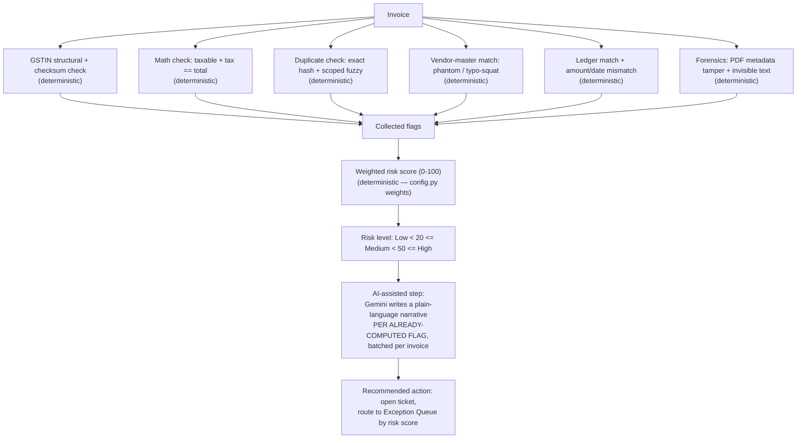
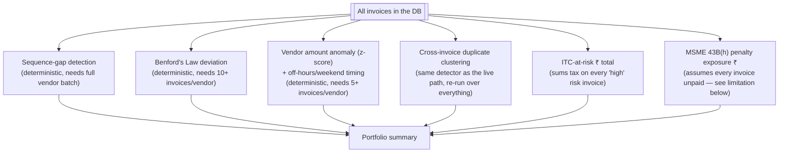
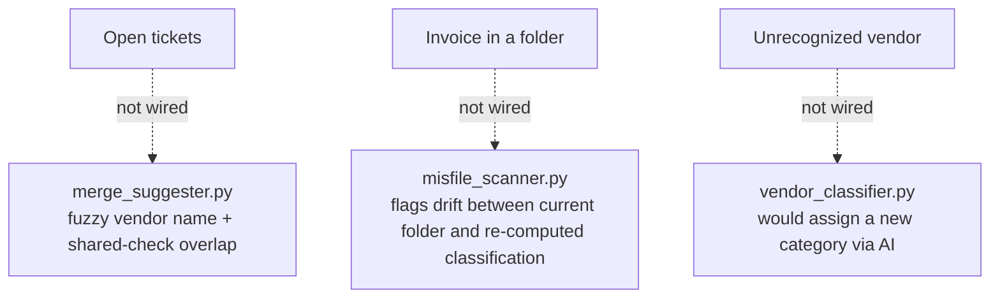

# Risk Detection Workflow

## Live path (what actually runs on every uploaded invoice today)

## Portfolio-level checks (run on demand from the Reports page, not per upload)
These run identically deterministic checks, but only make statistical sense
across a vendor's full invoice history, so they live in
`portfolio_analyzer.py` and run when someone opens the Reports page — not on
every individual upload:

## Implemented but not wired anywhere today

## Deterministic checks vs. AI-assisted analysis — the line, explicitly
**Deterministic (decides the score)**: GSTIN checksum, math check,
duplicate detection (hash + fuzzy), vendor-master matching, ledger matching,
PDF/image forensics — all per-invoice — plus, at the portfolio level,
sequence-gap, Benford's Law, vendor anomaly, and ITC/MSME-penalty
aggregation. All of these are pure computation; the same invoice (or
portfolio snapshot) always produces the same flags and the same numbers.
`risk_scorer.py` only sums flags that already exist; it never calls an AI
model.

**AI-assisted (explains, never decides)**: `narrative_generator.py` and
`msme_translator.py` call Gemini strictly *after* the score is final, to
turn a flag like `{"check": "duplicate_invoice", "reason": "Exact duplicate
of invoice at index 3..."}` into one short human sentence. If the Gemini call
fails or returns unparseable JSON, the code catches the exception and falls
back to the raw rule-generated reason string (with a second, hardcoded
fallback map for MSME narratives in `routes_frontend_adapter.py`) — the
score and the ticket are unaffected either way.

**Do not claim**: "AI detects fraud," "AI decides risk," or "the model flags
duplicates." The rule engine does all of that, whether per-invoice or
portfolio-wide; the model only writes the sentence describing what the
rules already found.

## Example (from actual code paths, not invented numbers)
An invoice with an invalid GSTIN checksum (`invalid_gstin`, weight 30) and a
flagged exact duplicate (`duplicate_invoice`, weight 40) scores
`30 + 40 = 70`, which is ≥ the `high` threshold of 50 in `config.py` →
**Risk Level: High**. `narrative_generator.py` then asks Gemini for two short
sentences, one per flag, and stitches the first one into a `summary` field
shown on the ticket. Because it's `high` risk, its CGST+SGST+IGST also gets
counted into `itc_at_risk` the next time someone runs a portfolio report.

## A limitation worth stating plainly
Vendor anomaly, sequence-gap, and Benford's Law never run at upload time —
only when the Reports page is opened. So a newly uploaded invoice's ticket
list will never include those three check types, even if the invoice would
trip them; you'd only see that in a subsequent portfolio report. If a judge
uploads one obviously-anomalous invoice and expects an immediate ticket for
it, say this explicitly rather than let the gap look like a bug.
