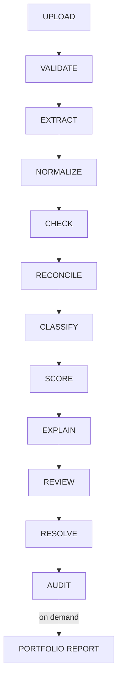

# System Workflow

| Step | What actually happens | Code |
|---|---|---|
| **UPLOAD** | User drags PDF/PNG/JPG files into the batch upload page; sent as multipart form data | `UploadBatch.jsx` → `routes_frontend_adapter.upload_invoices` |
| **VALIDATE** | File extension allowlist (pdf/png/jpg/jpeg), 15MB size cap, empty-file rejection, then an OCR-emptiness check to reject non-invoice uploads | `ingestion/file_validator.py`, `ingestion/content_sniff.py` |
| **EXTRACT** | Tesseract OCR renders the first page to an image and extracts raw text + per-word confidence (or reads embedded PDF text directly when available) | `extraction/ocr_engine.py` |
| **NORMALIZE** | Regex patterns pull out 9 named fields from the raw OCR text | `extraction/field_parser.py` |
| **CHECK** | Per-field confidence is scored; any critical field (invoice number, vendor name, total) below 80% confidence triggers a Gemini vision fallback call for just that field; then an internal math check (`taxable + tax == total`) runs | `extraction/confidence_scorer.py`, `extraction/gemini_fallback.py`, `extraction/math_check.py` |
| **RECONCILE** | GSTIN structural + checksum validation, inter/intra-state tax-type check, duplicate detection (exact hash tier, then scoped fuzzy tier), vendor-master matching (phantom/typo-squat), and ledger matching + amount/date mismatch checks all run against this invoice; PDF/image forensics run alongside | `reconciliation/gstin_validator.py`, `reconciliation/duplicate_detector.py`, `reconciliation/vendor_matcher.py`, `reconciliation/ledger_matcher.py`, `reconciliation/mismatch_checks.py`, `reconciliation/forensics.py` |
| **CLASSIFY** | The invoice is auto-sorted into a folder: `needs review` if critical fields are missing, the cached category if the vendor is known, otherwise `extra` | `classification/folder_sorter.py`, `classification/vendor_cache.py` |
| **SCORE** | Every flag produced above is weighted (config-driven weights in `config.py`) and summed into a 0–100 risk score with a Low/Medium/High level | `scoring/risk_scorer.py` |
| **EXPLAIN** | Gemini writes one short plain-language sentence per flagged check (batched into a single call per invoice, not per check), then a second Gemini call rewrites those into MSME-friendly language; if either call fails, the raw rule reason (or a hardcoded fallback sentence) is used instead | `ai_layer/narrative_generator.py`, `ai_layer/msme_translator.py` |
| **REVIEW** | Invoice + tickets appear in the Exception Queue, sorted by risk score; a human opens the invoice detail view to see extracted fields, confidence, flags, and a real PDF/image preview | `ExceptionQueue.jsx`, `InvoiceDetail.jsx` |
| **RESOLVE** | A human closes a ticket via a form that requires a reason (dropdown + note) — no silent close is possible in the UI or the API | `ResolutionForm.jsx` → `ticket_manager.update_status()` / `mark_false_positive()` |
| **AUDIT** | Every ticket action (created, status change, merge, false-positive) is appended to that ticket's `history` JSON column; every finalized invoice gets a SHA-256 hash over its key fields | `audit_trail/history_log.py`, `audit_trail/hash_sealer.py` |
| **PORTFOLIO REPORT** *(on demand, not part of the per-upload path)* | A human opens the Reports page; the backend re-scans every invoice in the DB for vendor-amount/off-hours anomalies, sequence gaps, and Benford's Law deviations, and computes ITC-at-risk and MSME-penalty exposure totals | `reconciliation/portfolio_analyzer.py`, `reconciliation/vendor_anomaly.py`, `reconciliation/sequence_gap.py`, `reconciliation/benford_check.py`, `scoring/itc_calculator.py`, `scoring/msme_penalty.py` |

## What's missing from this workflow today
Vendor anomaly, sequence-gap, and Benford's Law checks never run as part of
a single invoice's upload — they only run when someone opens the Reports
page and triggers a portfolio-wide scan (the PORTFOLIO REPORT branch above).
There is also no ticket-merge-suggestion, misfiled-invoice-scan, or AI
vendor-classification step anywhere in this workflow — `merge_suggester.py`,
`misfile_scanner.py`, and `vendor_classifier.py` exist as working code but
nothing calls them.
